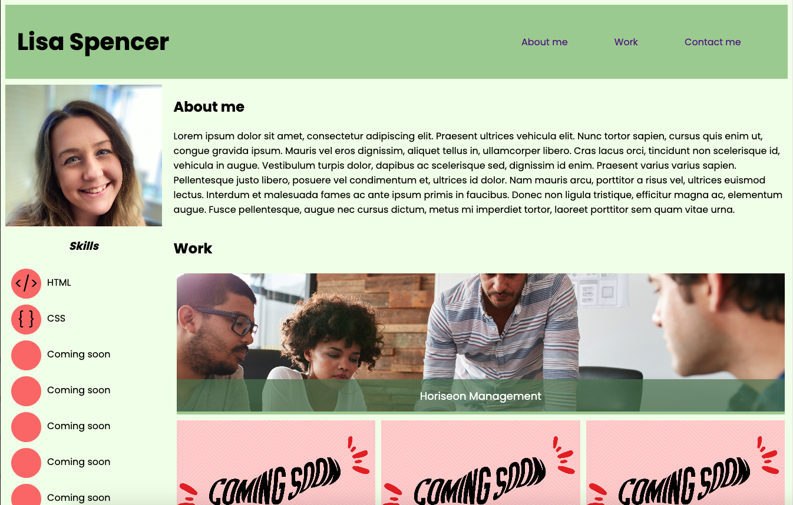

# Week 2 Challenge: Build Portfolio

## Project status
Finished acceptance criteria for Module 2 - still wanting to update it later on. 

## Name
Lisa Spencer: Developer Portfolio

## Description
This page is the challenge/homework for Week 2 of my Bootcamp course. The aim is to showcase my projects as a developer in the form of a website. There is use of HTML and CSS within this website. 

## Link to deployed application
https://lisaspencer1997.github.io/Week-2-Challenge-Build-Portfolio/

## Screenshot

## Support
Contact me on lisa-spencer@outlook.com if something is not working as intended.

## Contributing
N/A

## Authors and acknowledgment
N/A

## License
This is licenced through MIT. 
